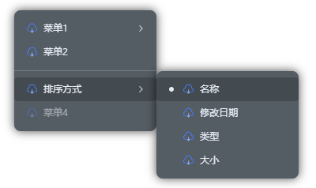

<div align="center">
  
  <h1>lt-contextmenu</h1>
  <p>
    <a href="./README.md">简体中文</a> | <strong>English</strong>
  </p>
  <p>A powerful context menu component based on Vue 3, featuring multi-level nesting, custom themes, and rich animations for a native-like experience.</p>

  [](https://github.com/lt-monster/lt-contextmenu)&nbsp;&nbsp;&nbsp;[](https://vuejs.org/)&nbsp;&nbsp;&nbsp;[](https://www.typescriptlang.org/)&nbsp;&nbsp;&nbsp;[](https://www.npmjs.com/package/lt-contextmenu)&nbsp;&nbsp;&nbsp;[](https://github.com/lt-monster/lt-contextmenu/blob/main/LICENSE)&nbsp;&nbsp;&nbsp;[](https://lt-contextmenu-doc.vercel.app/)

</div>

## ✨ Features

- 🎨 **Multiple Themes**: Built-in Google and Edge styles, supports Light/Dark themes.
- 📂 **Multi-level Submenus**: Supports infinite nested submenus.
- 🔧 **Highly Configurable**: Supports custom icons, disabled state, visibility, shortcut hints, etc.
- 🧩 **Flexible API**: Provides rich event callbacks and manual control methods.
- 📱 **Responsive Design**: Adaptive width and height.
- 📘 **TypeScript Support**: Complete type definitions for a better development experience.

## 🚀 Installation

### NPM/YARN/PNPM (Recommended)

```bash
$ npm i -S lt-contextmenu # yarn add lt-contextmenu # pnpm add lt-contextmenu
```

## 🎃 Usage
```html
<script setup lang="ts">
import 'lt-contextmenu/dist/style.css'
import { LtContextmenu, type MenuGroupOption, type MenuOption, type MenuValue } from 'lt-contextmenu'

const ltContextmenu = ref()

// Menu parameters passed
const data = {
  name: 'lijiatu'
}

// Menu configuration options, see below for details
const menuOptions = ref<MenuGroupOption[]>([
    {
        group: 'default',
        options: [
            {
                id: '1',
                icon: () => h(FileExport),
                label: 'Menu 1',
            },
            {
                id: '2',
                icon: () => h(FileExport),
                label: 'Menu 2',
            },
        ]
    }
])

</script>

<template>
  <div style="width: 100%;height: 100%;" @click.right="(e) => ltContextmenu?.open(e, data)">
    <LtContextmenu ref="ltContextmenu" :menu-options="menuOptions" />
  </div>
</template>
```

## Configuration
| Parameter | Description | Type | Required | Default |
| :--- | :--- | :--- | :---: | :---: |
| **menuOptions** | Core configuration options | `Array<MenuOption\|MenuGroupOption>` | ✅ | - |
| **menuStyle** | Menu style | `'google' \| 'edge'` | ⬜ | `'google'` |
| **menuTheme** | Menu theme | `'light' \| 'dark-element' \| 'dark-naive'` | ⬜ | `'light'` |
| **menuSize** | Menu size | `'normal' \| 'small' \| 'large'` | ⬜ | `'small'` |
| **width** | Fixed width, dynamic if not set | `number \| string` | ⬜ | - |
| **maxWidth** | Maximum width | `number \| string` | ⬜ | - |
| **height** | Fixed height, dynamic if not set (only valid when no submenus) | `number \| string` | ⬜ | - |
| **maxHeight** | Maximum height (only valid when no submenus) | `number \| string` | ⬜ | - |
| **groupClass** | Menu group class | `string` | ⬜ | - |
| **groupStyle** | Menu group style | `CSSProperties` | ⬜ | - |
| **itemClass** | Menu item class | `string` | ⬜ | - |
| **itemStyle** | Menu item style | `CSSProperties` | ⬜ | - |
| **expandTrigger** | Submenu trigger method | `'hover' \| 'click'` | ⬜ | `'hover'` |
| **overlay** | Overlay configuration | `{ enable: boolean, zIndex?: number }` | ⬜ | - |
| **beforeClose** | Callback before closing, can prevent closing | `(close: () => void) => void` | ⬜ | - |

### Type Definitions
```typescript
type MenuOption = {
    // Required, unique id
    id: string | number
    // Optional, menu icon
    icon?: (menuParam?: any, itemOption?: MenuOption) => VNode
    // Required, menu label
    label: string | ((menuParam?: any, itemOption?: MenuOption) => VNode | string)
    // Optional, visibility, won't render if false (v-if)
    visible?: boolean | ((menuParam?: any, itemOption?: MenuOption) => boolean)
    // Optional, disabled state, not clickable if true
    disabled?: boolean | ((menuParam?: any, itemOption?: MenuOption) => boolean)
    // Menu item type, default is 'menu', MenuItemType='menu'|'radio'
    type?: MenuItemType
    // Value when type is 'radio' or 'toggle', MenuValue=string|number|boolean|Array<string|number|boolean>
    value?: MenuValue | ((menuParam?: any) => MenuValue)
    // Menu item click event
    handler?: (menuParam?: any, value?: MenuValue, itemOption?: MenuOption) => void
    // Submenu, MenuChildrenOption=MenuGenericOption | ((menuParam?: any, value?: MenuValue, itemOption?: MenuOption) => MenuGenericOption)
    children?: MenuChildrenOption
    // Submenu custom dimensions, MenuChildrenStyle={ width?: string | number,maxWidth?: string | number,height?: string | number,maxHeight?: string | number }
    childrenStyle?: MenuChildrenStyle
    // Triggered when value changes for 'radio' or 'toggle' types
    change?: (menuParam?: any, value?: MenuValue, itemOption?: MenuOption) => void
}

type MenuGroupOption = {
    // Menu group name
    group: string
    // Menu items
    options: MenuOption[]
}
```
### Function Parameters
| Parameter | Description |
| :--- | :--- |
| **menuParam** | Parameters passed to the menu item |
| **value** | Selected value when menu type is radio |
| **itemOption** | The menu item option itself |

## Exposes
```javascript
{
    // Open menu
    open: (event: MouseEvent | { x: number, y: number }, param?: any) => void,
    // Close menu
    close: () => void,
    // Get menu option by id
    getMenuOption: (id: string | number) => MenuOption,
    // Manually set value for radio type menu
    setRadioValue: (id: string | number, value?: MenuValue) => void,
    // Get value for radio type menu by id
    getRadioValue: (id: string | number) => MenuValue
}
```

## 🎆 Preview


