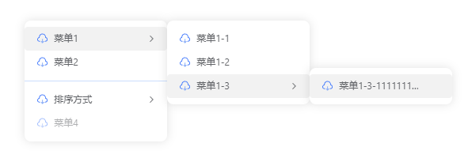
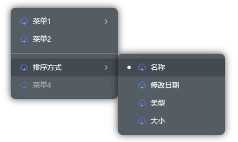

# lt-contextmenu

一款vue3开发的右键菜单组件

[](https://github.com/lt-monster/lt-contextmenu) [](https://github.com/lt-monster/lt-contextmenu/blob/main/LICENSE)

## 🚀 安装

### NPM 安装（推荐）

```bash
$ npm i -S lt-contextmenu # yarn add lt-contextmenu # pnpm add lt-contextmenu
```

## 🎃 使用
```html
<script setup lang="ts">
import 'lt-contextmenu/dist/style.css'
import { LtContextmenu, type MenuGroupOption, type MenuOption, type MenuValue } from 'lt-contextmenu'

const ltContextmenu = ref()

//传递的菜单参数
const data = {
  name: 'lijiatu'
}

//菜单配置项, 更多见下面的配置项说明
const menuOptions = ref<MenuGroupOption[]>([
    {
        group: 'default',
        options: [
            {
                id: '1',
                icon: () => h(FileExport),
                label: '菜单1',
            },
            {
                id: '2',
                icon: () => h(FileExport),
                label: '菜单2',
            },
        ]
    }
])

</script>

<template>
  <div style="width: 100%;height: 100%;" @click.right="(e) => ltContextmenu?.open(e, data)">
    <LtContextmenu ref="ltContextmenu" :menu-options="menuOptions" />
  </div>
</template>
```

## 配置项
| 参数 | 说明 | 类型 | 必填 | 默认值 |
| --- | --- | --- | --- | --- |
| **menuOptions** | 核心配置项 | Array<MenuOption\|MenuGroupOption> | ✅ | 无 |
| **menuStyle** | 菜单风格 | 'google' \| 'edge' | ⬜ | 'google' |
| **menuTheme** | 菜单主题 | 'light' \| 'dark-element' \| 'dark-naive' | ⬜ | 'light' |
| **menuSize** | 菜单大小 | 'normal' \| 'small' \| 'large' | ⬜ | 'small' |
| **width** | 菜单固定宽度, 不设置则动态宽度 | number\|string | ⬜ | 无 |
| **maxWidth** | 菜单最大宽度 | number\|string | ⬜ | 无 |
| **height** | 菜单固定高度, 不设置则动态高度, 仅对菜单容器内所有菜单都无子菜单时有效 | number\|string | ⬜ | 无 |
| **maxHeight** | 菜单最大高度, 仅对菜单容器内所有菜单都无子菜单时有效 | number\|string | ⬜ | 无 |
| **groupClass** | 菜单组的class | string | ⬜ | 无 |
| **groupStyle** | 菜单组的style | CSSProperties | ⬜ | 无 |
| **itemClass** | 菜单项的class | string | ⬜ | 无 |
| **itemStyle** | 菜单项的style | CSSProperties | ⬜ | 无 |
| **beforeClose** | 关闭前的回调，可终止菜单的关闭 | (close: () => void) => void | ⬜ | 无 |

### 类型说明
```typescript
type MenuOption = {
    //必填项, 唯一id
    id: string | number
    //可选, 菜单图标
    icon?: (menuParam?: any, itemOption?: MenuOption) => VNode
    //必填, 菜单文本
    label: string | ((menuParam?: any, itemOption?: MenuOption) => VNode | string)
    //可选, 菜单是否可见, 为false时该菜单不会渲染（v-if）
    visible?: boolean | ((menuParam?: any, itemOption?: MenuOption) => boolean)
    //可选, 菜单是否禁用, 为true时该菜单不可点击
    disabled?: boolean | ((menuParam?: any, itemOption?: MenuOption) => boolean)
    //菜单项的类型, 默认menu, MenuItemType='menu'|'radio'
    type?: MenuItemType
    //菜单类型为'radio'、'toggle'时选中的值, MenuValue=string|number|boolean|Array<string|number|boolean>
    value?: MenuValue | ((menuParam?: any) => MenuValue)
    //菜单项点击事件
    handler?: (menuParam?: any, value?: MenuValue, itemOption?: MenuOption) => void
    //子菜单, MenuChildrenOption=MenuGenericOption | ((menuParam?: any, value?: MenuValue, itemOption?: MenuOption) => MenuGenericOption)
    children?: MenuChildrenOption
    //子菜单自定义宽高, MenuChildrenStyle={ width?: string | number,maxWidth?: string | number,height?: string | number,maxHeight?: string | number }
    childrenStyle?: MenuChildrenStyle
    //其类型为'radio'、'toggle'时改变值会执行
    change?: (menuParam?: any, value?: MenuValue, itemOption?: MenuOption) => void
}

type MenuGroupOption = {
    //菜单组名称
    group: string
    //菜单项
    options: MenuOption[]
}
```
### 函数参数说明
| 参数 | 说明 |
| --- | --- |
| **menuParam** | 菜单项传递的参数 |
| **value** | 菜单类型为radio时选中的值 |
| **itemOption** | 菜单项本身 |

## Exposes
```javascript
{
    //打开菜单
    open: (event: MouseEvent | { x: number, y: number }, param?: any) => void,
    //关闭菜单
    close: () => void,
    //根据菜单id获取菜单选项
    getMenuOption: (id: string | number) => MenuOption,
    //当菜单类型为radio时手动设置其value
    setRadioValue: (id: string | number, value?: MenuValue) => void,
    //当菜单类型为radio时根据菜单id获取其value
    getRadioValue: (id: string | number) => MenuValue
}
```

## 🎆 预览


